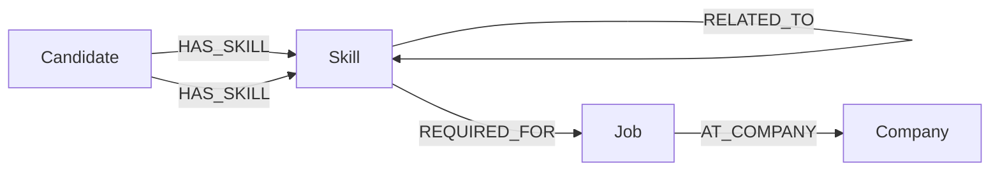

# SkillGraph

SkillGraph is a graph-powered talent intelligence application for connecting candidates, skills, job roles and companies in a single relationship-driven dataset.

## Use Case

The app helps recruiters and hiring teams answer practical workforce questions such as:

- Which job opportunities match a candidate's skill profile?
- Which candidates already have a particular capability?
- Which skills are adjacent to a target role and could be suggested for reskilling?
- Which jobs are connected to a company and which skills are required to reach them?

Instead of querying a relational schema through multiple joins, SkillGraph stores relationship context directly in a graph so that traversal-based questions stay natural and performant.

## Why a Graph Database?

A graph model is the natural fit because the domain is inherently networked:

- Candidates hold skills
- Skills are required for jobs
- Skills relate to other skills
- Jobs sit inside companies

The critical journey is not a single table lookup. It is a relationship walk such as:

`Candidate -> HAS_SKILL -> Skill -> REQUIRED_FOR -> Job`

That multi-hop traversal is represented directly in the data model and can be answered with a Cypher query instead of assembling a chain of table joins.

## Data Model

The graph contains four core node labels and a small set of relationship types.



### Labels and relationships

- `:Candidate` nodes have properties `id`, `name`, `title`, and `experience`
- `:Skill` nodes have properties `id` and `name`
- `:Job` nodes have properties `id` and `title`
- `:Company` nodes have properties `id` and `name`

Relationships:

- `(:Candidate)-[:HAS_SKILL]->(:Skill)`
- `(:Skill)-[:REQUIRED_FOR]->(:Job)`
- `(:Skill)-[:RELATED_TO]->(:Skill)`
- `(:Job)-[:AT_COMPANY]->(:Company)`

## Seed Data

The repository includes a seed script at [backend/seed.py](backend/seed.py) that clears existing graph data and loads a realistic sample dataset:

- Four companies
- Eight skills
- Four job roles
- Four candidate profiles
- Candidate-to-skill edges
- Job-to-skill requirement edges
- Skill-to-skill relatedness edges

The seed script uses the official Neo4j driver and parameterised Cypher operations.

## Queries

The application and test scripts exercise the graph through parameterised driver calls rather than string concatenation.

Main Cypher paths include:

1. Candidate profile lookup across candidates
2. Multi-hop job recommendation query

```cypher
MATCH (c:Candidate {id: $candidate_id})
      -[:HAS_SKILL]->(s:Skill)
      -[:REQUIRED_FOR]->(j:Job)
RETURN j.id AS id,
       j.title AS title,
       count(s) AS match_count,
       collect(s.name) AS matching_skills
ORDER BY match_count DESC
```

This query traverses candidate → skill → job through a two-edge path and is a graph-native answer to a relationship-aware hiring question.

3. Skill-to-candidate lookup

```cypher
MATCH (c:Candidate)-[:HAS_SKILL]->(s:Skill)
WHERE toLower(s.name) = toLower($skill_name)
RETURN c.id AS id,
       c.name AS name,
       c.title AS title
ORDER BY c.name
```

4. Relationship-style “awkward” relational query

```cypher
MATCH (c:Candidate)-[:HAS_SKILL]->(s:Skill)
RETURN c.name AS candidate,
       collect(s.name) AS skills
ORDER BY candidate
```

This is awkward for a relational model because it returns a variable-dimensional set of grouped skills without requiring a join explosion.

## Project Structure

```text
skillgraph/
├── backend/
│   ├── .env
│   ├── .gitignore
│   ├── main.py
│   ├── seed.py
│   ├── test_connection.py
│   └── test_queries.py
├── frontend/
│   ├── package.json
│   ├── index.html
│   ├── vite.config.js
│   └── src/
│       ├── App.jsx
│       ├── main.jsx
│       └── index.css
├── screenshots/
│   ├── dashboard.png
│   ├── candidate.png
│   └── graph.png
├── README.md
└── .gitignore
```

## Setup and Run

### 1. Create a CognoDB Cloud database

Create a CognoDB instance from the Cloud UI or provisioning flow, then copy the URI, username and password into a local environment file that is not committed.

The application expects the following environment variables:

```bash
COGNODB_URI=bolt+s://<your-host>
COGNODB_USERNAME=<your-user>
COGNODB_PASSWORD=<your-password>
```

Store them in the backend environment file as workspace-local settings. The repository ignores these values via [backend/.gitignore](backend/.gitignore) and the root [.gitignore](.gitignore).

### 2. Install backend dependencies

The workspace already contains a repository virtual environment in [.venv](.venv). Use that interpreter for all backend and seed commands.

```bash
cd /Users/sweety/Desktop/skillgraph
.venv/bin/python -m pip install neo4j python-dotenv fastapi uvicorn
```

### 3. Load the seed graph

```bash
cd backend
../.venv/bin/python seed.py
```

### 4. Run the API

```bash
cd backend
../.venv/bin/python -m uvicorn main:app --reload --host 127.0.0.1 --port 8000
```

### 5. Run the frontend

Install the Vite/React stack from [frontend/package.json](frontend/package.json):

```bash
cd frontend
npm install
npm run dev -- --host 127.0.0.1 --port 5173
```

The React UI consumes the FastAPI server on `http://127.0.0.1:8000` by default. If you deploy the backend elsewhere, create a frontend environment file using the same API host:

```bash
VITE_API_URL=http://<your-api-host>:8000
```

## Hosted Demo and Recording

This assignment requires a publicly reachable live demo and a short screen recording. The current repository is GitHub-ready locally and includes an API/graph implementation that can be deployed to a free host, but the actual public endpoint must be published after a cloud service is selected.

Recommended handoff fields:

- Hosted application demo: <add-your-public-demo-url>
- Short screen recording: <add-your-recording-url-or-gdrive-link>

## Screenshots

The assignment asks for screenshots of the UI. This repository uses screenshots in the [screenshots](screenshots) folder to record the main flows:

- [screenshots/dashboard.png](screenshots/dashboard.png)
- [screenshots/candidate.png](screenshots/candidate.png)
- [screenshots/graph.png](screenshots/graph.png)

## API Surface

The FastAPI service exposes:

- `GET /health` for readiness and connectivity checks
- `GET /candidates`
- `GET /skills`
- `GET /jobs`
- `GET /candidates/{candidate_id}/jobs`
- `GET /skills/{skill_name}/candidates`

## Notes on Error Handling

The application checks driver connectivity through the health endpoint and surfaces a friendly message if the graph database is unavailable. The UI calls the API and renders empty, loading and connection problem states when asynchronous requests fail.
